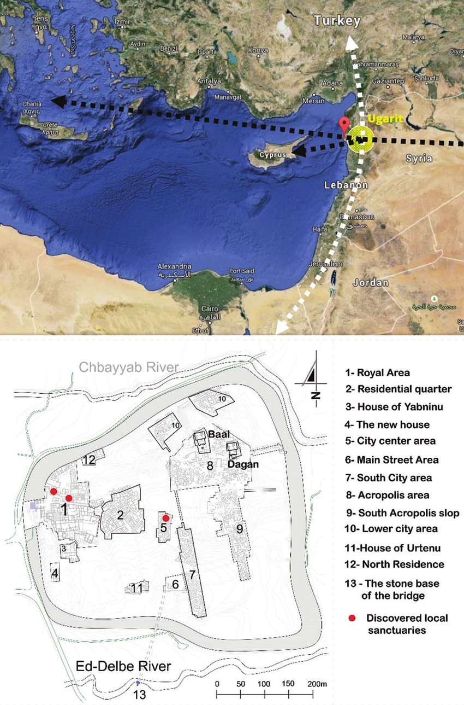
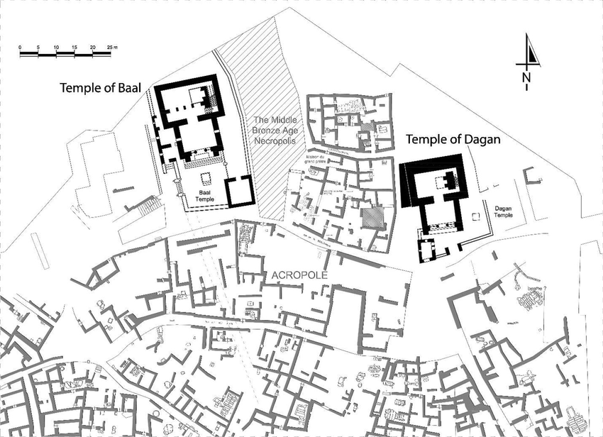
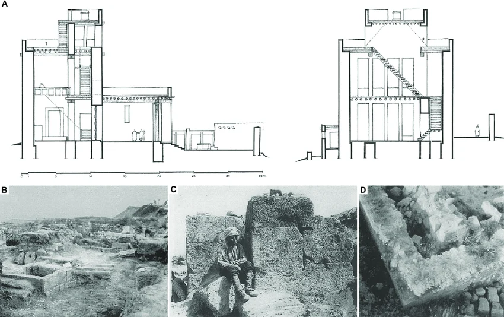

# 1. What is Ugarit? — historical introduction

*Hour 1 · ~20 min · presenter reading + slides*

> **Status:** outline stub. Bullet points are the talking points from the plan;
> expand each into 1–2 paragraphs and add illustrations from `../images/`.

## Key points to cover

- **A Late Bronze Age city-state.** Ugarit flourished c. 1450–1185 BCE on the
  northern Syrian coast at **Ras Shamra**, near modern Latakia.
- **A crossroads.** Ugarit sat between Egypt, the Hittite Empire, Mesopotamia,
  Cyprus (Alashiya), and the Levant — a hub of trade, diplomacy, and writing
  systems.
- **The Bronze Age collapse.** Ugarit was destroyed c. 1185 BCE and never
  reoccupied — which is precisely why its archives survived in place.
- **Background to later traditions.** Ugaritic myth and religion provide an early
  cultural and religious backdrop for the later biblical tradition (e.g. the god
  El, the storm-god Baal, poetic parallelism) — and connect outward to Phoenician,
  Hittite, Mesopotamian, and Greek myth. See *Ugarit among the ancient traditions*
  below.

## Fast historical frame

- **Place:** Ras Shamra, about 10 km north of Latakia and about 0.8 km from the
  Mediterranean coast.
- **Discovery:** the ruins came to scholarly attention after a local plough
  exposed remains near Minet el-Beida; French excavations under Claude F.A.
  Schaeffer began in **1929**. Main campaigns: **1928-1939**, resumed
  **1950-2008**.
- **Deep history:** the mound preserves a long settlement sequence, from early
  Neolithic occupation through Bronze Age urban phases.
- **Middle Bronze Age:** Egyptian, Aegean, Babylonian, Hurrian/Mitannian, and
  Mesopotamian links are visible in finds and cultural contacts.
- **Late Bronze Age "golden age":** c. **1450-1200 BCE**, with palaces,
  temples, shrines, libraries, and archives.
- **End:** Ugarit was destroyed around **1200 BCE**, in the wider crisis of
  invasions, earthquakes, famine, and political collapse.

*Source for this overview: Encyclopaedia Britannica,
["Ugarit"](https://www.britannica.com/place/Ugarit).*

*Figure: Ugarit and its Phoenician neighbours. © Noam Aharon, Rutgers University
(2023), published at
[r/PhoeniciaHistoryFacts](https://www.reddit.com/r/PhoeniciaHistoryFacts/comments/14romx4/ugarit_and_its_phoenician_neighbors/).*

This map is a quick reminder that Ugarit belongs in a northern Levantine coastal
setting, but it should not be collapsed into later Phoenicia. For the course, the
important point is adjacency: Ugarit is close enough to later Phoenician and
Canaanite worlds to matter for comparison, while still being a distinct Bronze
Age city-state.

*Figure: Late Bronze Age trade routes in the eastern Mediterranean. Source:
World History Encyclopedia.*

Trade routes help explain why Ugarit was multilingual and text-rich. Its coastal
position linked inland Syria, Anatolia, Cyprus, Egypt, and the Aegean, so its
archives preserve local concerns in an international setting.

*Figure: map of the Levant in the Late Bronze Age, showing the location of
Ugarit and Tel Beth-Shemesh. Prepared by I. Ben-Ezra; reproduced from Cécile
Fossé, Jonathan Yogev, José Mirão, Nicola Schiavon, and Yuval Goren,
"Archaeo-Material Study of the Cuneiform Tablet from Tel Beth-Shemesh,"
Tel Aviv 51.1 (2024): 3-17. DOI:
[10.1080/03344355.2024.2327796](https://doi.org/10.1080/03344355.2024.2327796).*

The map makes two points at once: Ugarit belonged to the northern Syrian coastal
world of Hatti, Amurru, Mitanni, Cyprus, and Egypt, while cuneiform writing also
circulated farther south in the Levant. Tel Beth-Shemesh is not Ugarit, but its
cuneiform tablet helps show the wider Late Bronze Age scribal landscape in which
Ugaritic archives should be understood.

*Figure: Ugarit's location and discovered areas. Top: Google Maps illustration
showing the location of Ugarit, with author analysis added in Photoshop. Bottom:
plan of the city of Ugarit showing the main temples and local sanctuaries,
produced by the author using AutoCAD and based on fieldwork in 2013. Reproduced
from Tarek Teba, "Culture as a drive for art and architecture: Ugarit's
religious architecture as cultural and societal manifestations," Arts &
Communication (2024), DOI:
[10.36922/ac.3132](https://doi.org/10.36922/ac.3132), CC BY-NC 4.0.*

For this workshop, the city plan is especially useful because it shifts the
question from "Where was Ugarit?" to "How was Ugarit organized?" The royal area,
residential quarters, acropolis, temples of Baal and Dagan, and smaller local
sanctuaries show that the textual archives were embedded in a dense urban and
ritual landscape.

*Figure: the Acropolis area at Ugarit, produced by Tarek Teba and
based on fieldwork in 2013. Reproduced from Teba, "Culture as a drive for art
and architecture" (2024), DOI:
[10.36922/ac.3132](https://doi.org/10.36922/ac.3132), CC BY-NC 4.0.*

The acropolis view highlights the proximity of the major temples to one another
and to surrounding built space. That matters for reading Ugaritic texts: myths,
rituals, offerings, administrative lists, and letters were not abstract literary
objects, but documents produced in a city where political, religious, and scribal
institutions stood close together.

*Figure: archaeological reading of the Temple of Baal. Panel A shows proposed
sections by Callot and Monchambert (2011); panels B-D show the Temple of Baal's
condition in the 1930s, including the external altar, the temple ante and corner,
and the northeast corner of the most holy place. Reproduced from Teba, "Culture
as a drive for art and architecture" (2024), DOI:
[10.36922/ac.3132](https://doi.org/10.36922/ac.3132), CC BY-NC 4.0.*

The Temple of Baal anchors the religious side of the introduction. Ugaritic
texts preserve divine names, myths, offerings, and ritual language; the temple
architecture gives those texts a spatial counterpart.

## Ugarit among the ancient traditions

> **Status:** comparative / intertextual context. Pairs with the sacred-mountain
> note in [`05-formulas.md`](05-formulas.md) and the omen-science note in
> [`07-divination.md`](07-divination.md).

Because Ugarit sat at a Late Bronze Age crossroads (above), its archives let us
watch the *same* gods, the *same* stories, and even the *same* sacred mountain
travel across the Canaanite/biblical, Phoenician, Hittite, Mesopotamian, and Greek
worlds. For a non-specialist audience this is a payoff of the whole course: Ugarit
is the hinge that makes those connections visible.

### The Hebrew Bible — the closest tradition

Ugaritic religion is our best picture of the Canaanite world out of which Israel
emerged, so the overlaps are dense and well studied:

- **El** (*ʾil*), the aged head of the Ugaritic pantheon, shares his name and many
  epithets with biblical **ʾĒl / ʾElōhîm**.
- **Baal**, the storm-god "**Rider on the Clouds**" (*rkb ʿrpt*), supplies imagery
  later attached to **YHWH** (cf. *rōkēb bāʿarābôt*, Ps 68:5).
- **Athirat** ↔ biblical **Asherah**; the seven-headed sea-dragon **Lôtan** (*ltn*)
  ↔ **Leviathan** (Isa 27:1; Ps 74:13–14).
- The **parallelism** and stock word-pairs of Ugaritic poetry illuminate the
  formulaic character of biblical Hebrew verse (see [`05-formulas.md`](05-formulas.md)).

Two ready-made datasets in this repo let you *explore* this rather than just assert
it:

- **`data/intertextual_connections.json`** — 79 verse-level Bible ↔ Ugaritic links
  harvested from [intertextual.bible](https://intertextual.bible) (e.g. Gen 2:2 and
  Gen 10:5 ↔ the **Baal Cycle**).
- **UgaritLab's biblical cross-reference layer** (the `TCS_refs` set for KTU 1.1–1.6)
  — the classic verse list keyed to the Baal Cycle: Ps 29, Ps 48, Isa 14:13,
  Isa 27:1, Ps 74:13–14, and more.

### Phoenician — Philo of Byblos and Sanchuniathon

The Canaanite mythology of Ugarit did not die with the city. A Greek-language
window onto its first-millennium afterlife is the ***Phoenician History*** of
**Philo of Byblos** (Herennius Philo, late 1st–early 2nd c. CE). Philo claims merely
to *translate* an ancient Phoenician sage, **Sanchuniathon**, said to predate the
Trojan War. The work survives only because the Church Father **Eusebius** quoted it
in his *Praeparatio Evangelica* (1.9–10) — to argue that pagan religion was just
deified humans.

That apologetic framing matches Philo's method: his is a **euhemeristic** theogony,
in which gods are rationalized as ancient kings and inventors. Read through the
standard *interpretatio*, his pantheon lines up with both the Ugaritic and the Greek:

| Philo / Phoenician | Ugaritic | Greek | Role |
|--------------------|----------|-------|------|
| Elos / **Kronos** | **El** (*ʾil*) | Kronos | aged high god |
| **Dagon** | **Dagan** | — | grain; father of Baal |
| **Hadad / Demarous** | **Baal** (*Haddu*) | Zeus | active storm-god |
| **Astarte** | **ʿAṯtart** | Aphrodite | great goddess |

The decisive link to Ugarit: Philo reports (*PE* 1.10.31) a scene of **Hadad and
Astarte reigning with Kronos' (El's) assent** — and *exactly* that scene turns up
in a tablet from Ras Shamra, **RS 24.252** (*Ugaritica V*). So there is a traceable
chain: **Bronze-Age Ugarit → Phoenician myth → Philo (Roman era) → Eusebius
(Christian apologetics)**.

> **A scholarly caution worth teaching.** Whether Philo really had an ancient
> written "Sanchuniathon," or constructed him, is disputed. The standard critical
> edition (Attridge & Oden 1981) is *more sceptical* than many — yet still judges
> the work "a valuable witness to Canaanite mythology." A good live example of
> source-criticism: a genuinely old tradition, transmitted through layers of later
> agendas.

### Greek — the storm-god and the dragon

Greek myth shares Ugarit's signature plot, the **Chaoskampf**: a young storm/sky
god defeats a monstrous embodiment of the sea or chaos. Baal defeats **Yammu** (Sea)
and the dragon **Lôtan**; **Zeus defeats Typhon**. The parallel is not just
thematic — it is *geographic*: in **Apollodorus** (*Library* 1.6.3) Zeus pursues
Typhon "as far as **Mount Casius, which overhangs Syria**" (trans. Frazer) — and that
mountain is none other than Baal's holy **Ṣapānu**. This shared mountain is the single most
vivid connection in the course; it gets its own treatment in
[`05-formulas.md`](05-formulas.md).

| Tradition | Storm/sky god | Chaos foe | Battleground |
|-----------|---------------|-----------|--------------|
| Ugarit | **Baal** | Yammu (Sea) / Lôtan | Mt **Ṣapānu** |
| Greece | **Zeus** | **Typhon** | Mt **Kásion** |
| Hatti | Storm-god (Tarḫunna / Teshub) | **Illuyanka** | Mt **Ḫazzi** |
| Babylon | Marduk | Tiamat (Sea) | — |
| Israel | YHWH | **Leviathan** / Rahab | "Zaphon" |

### Hittite / Hurrian — Ugarit's overlord

In its golden age Ugarit was a **vassal of the Hittite empire**, and Hurro-Hittite
literature shares the same mythic grammar:

- The **Kumarbi cycle** ("Kingship in Heaven") tells a **succession myth** — sky-
  father **Anu → Kumarbi → the storm-god Teshub** — that closely mirrors Hesiod's
  *Theogony* (**Ouranos → Kronos → Zeus**). Ugarit and Phoenicia lie on the route by
  which such Near Eastern material reached Greek poetry.
- In the **Song of Ullikummi**, the Storm-god climbs **Mount Ḫazzi** — the same
  Ṣapānu / Kásion — to confront a stone giant rising from the sea.
- The **Storm-god vs the dragon Illuyanka** is the Hittite Chaoskampf.

### Egypt — prestige and the "made-in-Canaan" caveat

Egyptian influence is everywhere at Ugarit — royal gift-statuary, stelae, and
imported luxuries — but a useful caution for students of material culture is that
much of the "Egyptian" artwork found across the Levant (scarabs, faience,
Egyptianizing ivories) was in fact **produced in Canaanite / Levantine workshops**,
not imported from Egypt. "Egyptian-looking" at Ugarit often means *local craft in a
prestigious international style*, not direct import.

> **Central idea:** same gods, same story, even the same mountain. Ugarit lets a
> newcomer *see* the shared substrate beneath Canaanite, biblical, Phoenician,
> Anatolian, Mesopotamian, and Greek myth — and the in-repo datasets let them test
> it for themselves.

## Why Ugarit is ideal for Digital Humanities

> **Central idea:** the corpus is comparatively **compact** yet **rich** in genres
> and historically dense — small enough to analyze end-to-end in a workshop, large
> enough to show real patterns.

## Suggested illustrations
- Map: Ugarit and neighbouring coastal cities (`images/ugarit_and_neighbours.jpg`).
- Trade-route map of the Late Bronze eastern Mediterranean
  (`images/trade_routes.jpg`).
- Map: Ugarit and Tel Beth-Shemesh in the LBA Levant
  (`images/map_lba_ugarit_beth_shemesh.png`).
- Site and temple plans of Ugarit
  (`images/Ugarits-location-and-discovered-areas-A-Google-Maps-illustration-showing-the-location.png`,
  `images/The-Acropolis-area-Ugarit-Produced-by-the-author-using-AutoCAD-software-and-based-on.png`).
- Temple of Baal architectural reading
  (`images/Archeological-reading-of-the-Temple-of-Baal-A-Temple-of-Baal-Proposed-sections-by.png`).
- Greek reflex of the storm-god myth: a Chalcidian black-figure hydria of **Zeus
  battling Typhon** (c. 540 BCE, Munich, Staatliche Antikensammlungen 596; ΖΕΥΣ
  inscribed) — pairs with the Ṣapānu = Kásion point in `05-formulas.md`.
  *(Licence: confirm reuse terms before adding the file — see `images/README.md`.)*
- Timeline strip: foundation → archives → 1185 BCE collapse.

## Further reading
- Wilfred G. E. Watson and Nicolas Wyatt, eds., *Handbook of Ugaritic Studies*,
  Handbook of Oriental Studies, Section 1: The Near and Middle East 39
  (Leiden: Brill). <https://brill.com/display/title/6633>
- Harold W. Attridge and Robert A. Oden, Jr., *Philo of Byblos: The Phoenician
  History*, CBQ Monograph Series 9 (Washington, DC: Catholic Biblical Association,
  1981) — the comparative Phoenician source.
- Frank Moore Cross, *Canaanite Myth and Hebrew Epic* (Cambridge, MA: Harvard
  University Press, 1973) — Ugarit ↔ the Bible.
- M. L. West, *The East Face of Helicon: West Asiatic Elements in Greek Poetry and
  Myth* (Oxford: Clarendon, 1997) — Near Eastern roots of Greek myth.
- Harry A. Hoffner, Jr., *Hittite Myths*, 2nd ed., Writings from the Ancient World 2
  (Atlanta: Scholars Press, 1998) — the Kumarbi cycle and Illuyanka.

## TODO
- [ ] Expand each bullet into prose.
