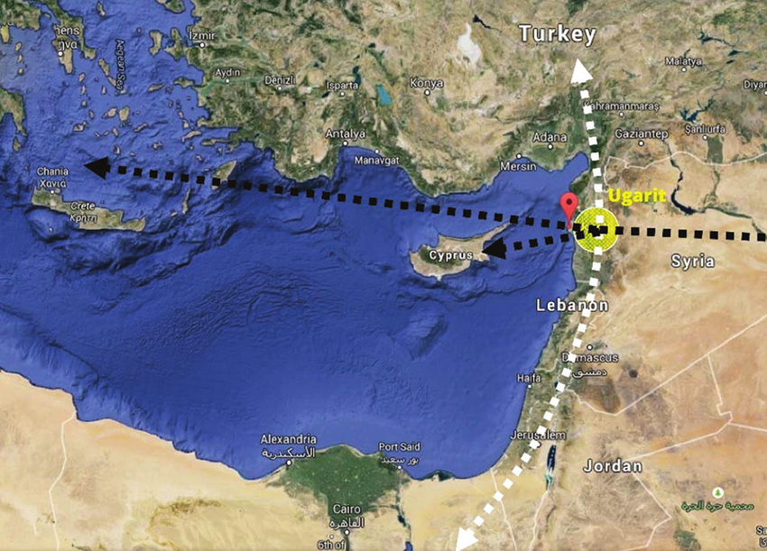
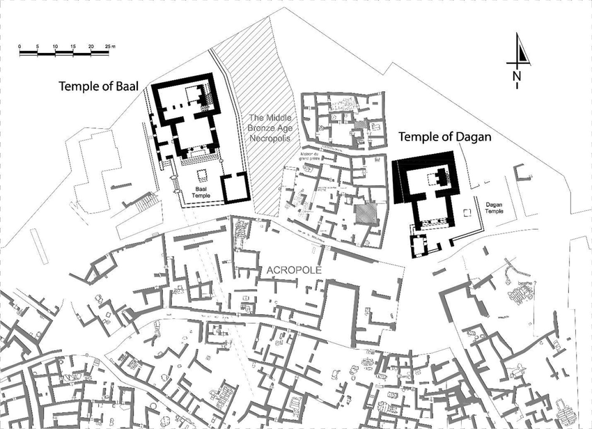
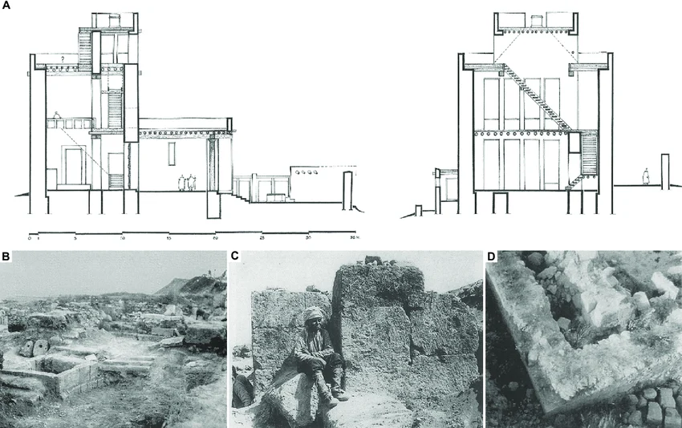

# 1. What is Ugarit? — historical introduction

*Hour 1 · ~10 min core introduction · optional comparative reading*

The short opening below supplies the minimum historical frame needed for the
metadata work in notebook `1a`. The longer comparative section is a reference,
not a claim that every tradition is directly descended from Ugarit.

## Key points to cover

- **A Late Bronze Age city-state.** Ugarit flourished c. 1450–1185 BCE on the
  northern Syrian coast at **Ras Shamra**, near modern Latakia.
- **A crossroads.** Ugarit sat between Egypt, the Hittite Empire, Mesopotamia,
  Cyprus (Alashiya), and the Levant — a hub of trade, diplomacy, and writing
  systems.
- **The end of the kingdom.** The Late Bronze Age city was destroyed around
  1190–1185 BCE. It was not rebuilt as a comparable urban centre, although
  archaeologists have reported limited traces of activity after the destruction.
  The destruction horizon helped preserve archives in their archaeological
  contexts; clay, fire, abandonment, and modern recovery all shaped what survives.
- **Background to later traditions.** Ugaritic myth and religion provide an early
  cultural and religious backdrop for the later biblical tradition (e.g. the god
  El, the storm-god Baal, poetic parallelism) — and connect outward to Phoenician,
  Hittite, Mesopotamian, and Greek myth. See *Ugarit among the ancient traditions*
  below.

## Fast historical frame

- **Place:** Ras Shamra, about 10 km north of Latakia and about 0.8 km from the
  Mediterranean coast.
- **Discovery and excavation:** a tomb exposed near Minet el-Beida in **1928**
  led Claude F. A. Schaeffer's expedition to begin excavating Ras Shamra in
  **1929**. Work stopped during the Second World War; limited investigations
  resumed in 1948–49 and full-scale excavation in 1950.
- **Deep history:** the mound preserves a long settlement sequence, from early
  Neolithic occupation through Bronze Age urban phases.
- **Middle Bronze Age:** Egyptian, Aegean, Babylonian, Hurrian/Mitannian, and
  Mesopotamian links are visible in finds and cultural contacts.
- **Late Bronze Age "golden age":** c. **1450-1200 BCE**, with palaces,
  temples, shrines, libraries, and archives.
- **End:** Ugarit was destroyed around **1190–1185 BCE**, within the wider
  disruption at the end of the Late Bronze Age. Drought, food insecurity,
  political fragmentation, warfare, and population movement belong to the
  historical discussion, but the workshop should not present a single cause as
  settled.

*Source for this overview: Encyclopaedia Britannica,
["Ugarit"](https://www.britannica.com/place/Ugarit).*

*Figure: Ugarit and its Phoenician neighbours. © Noam Aharon, Rutgers University
(2023), published at
[r/PhoeniciaHistoryFacts](https://www.reddit.com/r/PhoeniciaHistoryFacts/comments/14romx4/ugarit_and_its_phoenician_neighbors/).*

This map is a quick reminder that Ugarit belongs in a northern Levantine coastal
setting, but it should not be collapsed into later Phoenicia. For the course, the
important point is adjacency: Ugarit is close enough to later Phoenician and
Canaanite worlds to matter for comparison, while still being a distinct Bronze
Age city-state.

*Figure: Late Bronze Age trade routes in the eastern Mediterranean. Source:
World History Encyclopedia.*

Trade routes help explain why Ugarit was multilingual and text-rich. Its coastal
position linked inland Syria, Anatolia, Cyprus, Egypt, and the Aegean, so its
archives preserve local concerns in an international setting.

*Figure: Ugarit's location and discovered areas. Google Maps illustration
showing the location of Ugarit.*

*Figure: the Acropolis area at Ugarit, produced by Tarek Teba and
based on fieldwork in 2013. Reproduced from Teba, "Culture as a drive for art
and architecture" (2024), DOI:
[10.36922/ac.3132](https://doi.org/10.36922/ac.3132), CC BY-NC 4.0.*

The acropolis view highlights the proximity of the major temples to one another
and to surrounding built space. That matters for reading Ugaritic texts: myths,
rituals, offerings, administrative lists, and letters were not abstract literary
objects, but documents produced in a city where political, religious, and scribal
institutions stood close together.

*Figure: archaeological reading of the Temple of Baal. Panel A shows proposed
sections by Callot and Monchambert (2011); panels B-D show the Temple of Baal's
condition in the 1930s, including the external altar, the temple ante and corner,
and the northeast corner of the most holy place. Reproduced from Teba, "Culture
as a drive for art and architecture" (2024), DOI:
[10.36922/ac.3132](https://doi.org/10.36922/ac.3132), CC BY-NC 4.0.*

The Temple of Baal anchors the religious side of the introduction. Ugaritic
texts preserve divine names, myths, offerings, and ritual language; the temple
architecture gives those texts a spatial counterpart.

## Ugarit among the ancient traditions

> **Comparative rule:** similarity is evidence for comparison, not automatically
> for borrowing, identity, or a direct line of descent. For every parallel ask:
> (1) what are the dates, (2) what languages and genres are involved, (3) which
> words or motifs actually correspond, and (4) what route of transmission is
> being proposed? Notebook [`3a`](../notebooks/3a_ngrams_formulas.ipynb) tests
> verbal recurrence; notebook [`3c`](../notebooks/3c_divination_trees.ipynb)
> compares the structure of omen collections.

Because Ugarit sat at a Late Bronze Age crossroads, its archives preserve an
early Northwest Semitic corpus beside Akkadian and Hurrian material. They let us
compare divine names, poetic formulae, story patterns, and scholarly genres
across the Levant and eastern Mediterranean. Some correspondences are linguistic,
some iconographic, and some structural; they do not all imply the same historical
relationship.

### The Hebrew Bible — the closest tradition

Ugaritic is an exceptionally rich Late Bronze Age comparator for biblical Hebrew
and later Levantine religion. It is earlier than the biblical manuscripts and
closely related linguistically, but Ugarit is not a direct ancestor of every
biblical form:

- **El** (*ʾil*), head of the Ugaritic pantheon, shares the Northwest Semitic
  divine title/name *ʾil* with biblical **ʾĒl**; comparison must still distinguish
  a common noun, a divine name, and the plural/form **ʾĕlōhîm**.
- **Baal**, the storm-god "**Rider on the Clouds**" (*rkb ʿrpt*), offers a close
  comparator for biblical storm-theophany. Psalm 68:5 is often discussed here,
  although Hebrew *ʿărābôt* is not simply the Ugaritic word *ʿrpt*; Psalm 104:3
  supplies unambiguous cloud-riding imagery.
- **Athirat** ↔ biblical **Asherah**; the seven-headed sea-dragon **Lôtan** (*ltn*)
  ↔ **Leviathan** (Isa 27:1; Ps 74:13–14).
- The **parallelism** and stock word-pairs of Ugaritic poetry illuminate the
  formulaic character of biblical Hebrew verse (compare the corpus method in
  notebook [`3a`](../notebooks/3a_ngrams_formulas.ipynb)).

Two ready-made datasets in this repo let you *explore* this rather than just assert
it:

- **`data/intertextual_connections.json`** — 79 verse-level Bible ↔ Ugaritic links
  harvested from [intertextual.bible](https://intertextual.bible) (e.g. Gen 2:2 and
  Gen 10:5 ↔ the **Baal Cycle**).
- **Biblical cross-reference layer** (the `TCS_refs` set for KTU 1.1–1.6)
  — the classic verse list keyed to the Baal Cycle: Ps 29, Ps 48, Isa 14:13,
  Isa 27:1, Ps 74:13–14, and more.

### Phoenician — Philo of Byblos and Sanchuniathon

The Canaanite mythology of Ugarit did not die with the city. A Greek-language
window onto its first-millennium afterlife is the ***Phoenician History*** of
**Philo of Byblos** (Herennius Philo, late 1st–early 2nd c. CE). Philo claims merely
to *translate* an ancient Phoenician sage, **Sanchuniathon**, said to predate the
Trojan War. The work survives only because the Church Father **Eusebius** quoted it
in his *Praeparatio Evangelica* (1.9–10) — to argue that pagan religion was just
deified humans.

That apologetic framing matches Philo's method: his is a **euhemeristic** theogony,
in which gods are rationalized as ancient kings and inventors. Read through the
standard *interpretatio*, his pantheon lines up with both the Ugaritic and the Greek:

| Philo / Phoenician | Ugaritic | Greek | Role |
|--------------------|----------|-------|------|
| Elos / **Kronos** | **El** (*ʾil*) | Kronos | aged high god |
| **Dagon** | **Dagan** | — | grain; father of Baal |
| **Hadad / Demarous** | **Baal** (*Haddu*) | Zeus | active storm-god |
| **Astarte** | **ʿAṯtart** | Aphrodite | great goddess |

Philo reports (*PE* 1.10.31) that **Astarte and Zeus Demarous** ruled with
Kronos' consent, a useful comparison with Levantine configurations of Astarte,
the storm-god, and El. It is not, however, a verbatim survival of a known Ugaritic
tablet. **RS 24.252 / KTU 1.108**, sometimes invoked too loosely in this context,
is a damaged ritual invitation and royal blessing involving Rap̣iʾu, Anat, Baal,
and other deities. The responsible claim is continuity and reconfiguration of
West Semitic mythic material, transmitted to us through Philo and Eusebius—not a
documentable tablet-to-text chain.

> **A scholarly caution worth teaching.** Whether Philo really had an ancient
> written "Sanchuniathon," or constructed him, is disputed. The standard critical
> edition (Attridge & Oden 1981) is *more sceptical* than many — yet still judges
> the work "a valuable witness to Canaanite mythology." A good live example of
> source-criticism: a genuinely old tradition, transmitted through layers of later
> agendas.

### Greek — the storm-god and the dragon

Greek myth shares Ugarit's signature plot, the **Chaoskampf**: a young storm/sky
god defeats a monstrous embodiment of the sea or chaos. Baal defeats **Yammu** (Sea)
and the dragon **Lôtan**; **Zeus defeats Typhon**. The parallel is not just
thematic — it is *geographic*: in **Apollodorus** (*Library* 1.6.3) Zeus pursues
Typhon "as far as **Mount Casius, which overhangs Syria**" (trans. Frazer) — and that
mountain is none other than Baal's holy **Ṣapānu**. This shared mountain is one
of the course's most vivid comparisons; notebook
[`3a`](../notebooks/3a_ngrams_formulas.ipynb) connects the historical question to
searchable formulae.

| Tradition | Storm/sky god | Chaos foe | Battleground |
|-----------|---------------|-----------|--------------|
| Ugarit | **Baal** | Yammu (Sea) / Lôtan | Mt **Ṣapānu** |
| Greece | **Zeus** | **Typhon** | Mt **Kásion** |
| Hatti | Storm-god (Tarḫunna / Teshub) | **Illuyanka** | Mt **Ḫazzi** |
| Babylon | Marduk | Tiamat (Sea) | — |
| Israel | YHWH | **Leviathan** / Rahab | "Zaphon" |

### Hittite / Hurrian — Ugarit's overlord

In its golden age Ugarit was a **vassal of the Hittite empire**, and Hurro-Hittite
literature shares the same mythic grammar:

- The **Kumarbi cycle** ("Kingship in Heaven") tells a **succession myth** — sky-
  father **Anu → Kumarbi → the storm-god Teshub** — that closely mirrors Hesiod's
  *Theogony* (**Ouranos → Kronos → Zeus**). Ugarit and Phoenicia lie on the route by
  which such Near Eastern material reached Greek poetry.
- In the **Song of Ullikummi**, the Storm-god climbs **Mount Ḫazzi** — the same
  Ṣapānu / Kásion — to confront a stone giant rising from the sea.
- The **Storm-god vs the dragon Illuyanka** is the Hittite Chaoskampf.

### Egypt — prestige and the "made-in-Canaan" caveat

Egyptian influence is everywhere at Ugarit — royal gift-statuary, stelae, and
imported luxuries — but a useful caution for students of material culture is that
much of the "Egyptian" artwork found across the Levant (scarabs, faience,
Egyptianizing ivories) was in fact **produced in Canaanite / Levantine workshops**,
not imported from Egypt. "Egyptian-looking" at Ugarit often means *local craft in a
prestigious international style*, not direct import.

> **Central idea:** related names, motifs, and scholarly forms can travel, while
> each corpus reworks them in a particular language, genre, and historical
> setting. The digital task is to locate patterns; the philological task is to
> decide which comparisons the evidence can bear.

## Why Ugarit is ideal for Digital Humanities

> **Central idea:** the corpus is comparatively **compact** yet **rich** in genres
> and historically dense — small enough to analyze end-to-end in a workshop, large
> enough to show real patterns.

## Suggested illustrations
- Map: Ugarit and neighbouring coastal cities (`images/ugarit_and_neighbours.jpg`).
- Trade-route map of the Late Bronze eastern Mediterranean
  (`images/trade_routes.jpg`).
- Site and temple plans of Ugarit
  (`images/Ugarits-location-and-discovered-areas-A-Google-Maps-illustration-showing-the-location.png`,
  `images/The-Acropolis-area-Ugarit-Produced-by-the-author-using-AutoCAD-software-and-based-on.png`).
- Temple of Baal architectural reading
  (`images/Archeological-reading-of-the-Temple-of-Baal-A-Temple-of-Baal-Proposed-sections-by.png`).
- Greek reflex of the storm-god myth: a Chalcidian black-figure hydria of **Zeus
  battling Typhon** (c. 540 BCE, Munich, Staatliche Antikensammlungen 596; ΖΕΥΣ
  inscribed) — pairs with the Ṣapānu = Kásion point in notebook `3a`.
  *(Licence: confirm reuse terms before adding the file — see `images/README.md`.)*
- Timeline strip: foundation → archives → 1185 BCE collapse.

## Further reading
- Marguerite Yon, *The City of Ugarit at Tell Ras Shamra* (Winona Lake, IN:
  Eisenbrauns, 2006) — archaeology, urban history, and the destruction horizon.
- Dennis Pardee, *Ritual and Cult at Ugarit*, Writings from the Ancient World 10
  (Atlanta: Society of Biblical Literature, 2002), especially pp. 127–45 on
  divination and pp. 192–95 on RS 24.252.
- Carolina López-Ruiz, "Greek and Canaanite Mythologies: Zeus, Baal, and Their
  Rivals," *Religion Compass* 8 (2014): 1–11 — a careful comparative framework.
- Wilfred G. E. Watson and Nicolas Wyatt, eds., *Handbook of Ugaritic Studies*,
  Handbook of Oriental Studies, Section 1: The Near and Middle East 39
  (Leiden: Brill). <https://brill.com/display/title/6633>
- Harold W. Attridge and Robert A. Oden, Jr., *Philo of Byblos: The Phoenician
  History*, CBQ Monograph Series 9 (Washington, DC: Catholic Biblical Association,
  1981) — the comparative Phoenician source.
- Frank Moore Cross, *Canaanite Myth and Hebrew Epic* (Cambridge, MA: Harvard
  University Press, 1973) — Ugarit ↔ the Bible.
- M. L. West, *The East Face of Helicon: West Asiatic Elements in Greek Poetry and
  Myth* (Oxford: Clarendon, 1997) — Near Eastern roots of Greek myth.
- Harry A. Hoffner, Jr., *Hittite Myths*, 2nd ed., Writings from the Ancient World 2
  (Atlanta: Scholars Press, 1998) — the Kumarbi cycle and Illuyanka.

## TODO
- [ ] Add page-level citations from the chosen historical handbook before the
      workshop is published as a standalone reading.
