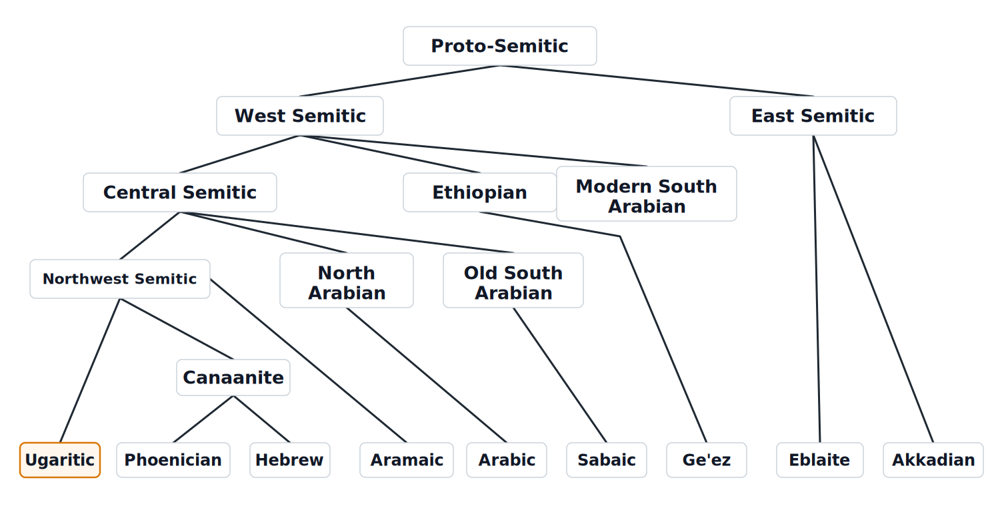
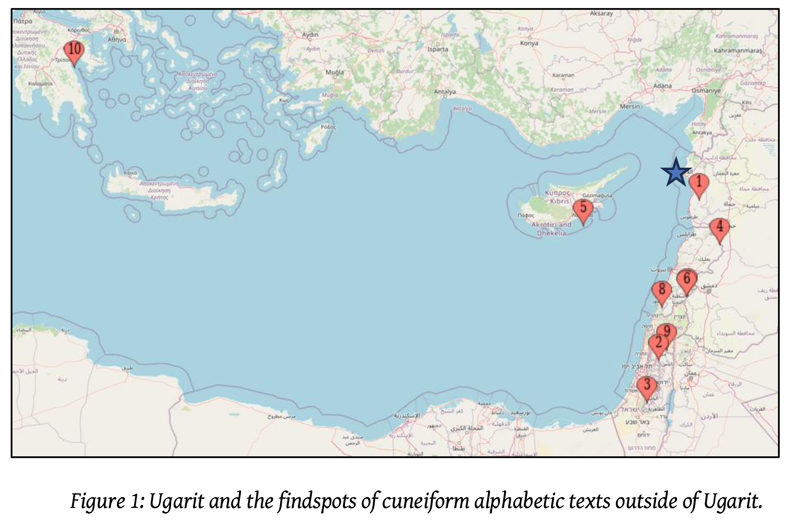
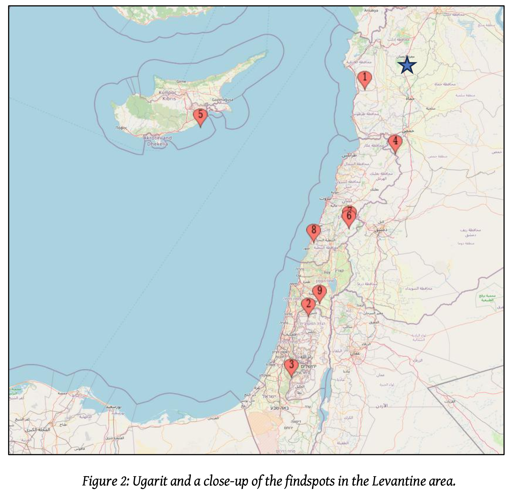

# 3. The Ugaritic alphabet and language in Semitic context

*Hour 1 · ~10 min reading + leads into notebook `1b` (~15 min)*

> **Status:** outline stub.

## The alphabet
- Ugaritic was written in a **cuneiform alphabet** — wedge-shaped signs, but
  **alphabetic**, not the syllabic cuneiform of Mesopotamia.
- ~30 signs; the **canonical order** is known from school **abecedary** tablets
  (see KTU 5.6 in the sample data).
- It is one of the earliest attested alphabetic orderings, broadly matching the
  later "abgad" sequence of West Semitic scripts.

### Ugaritic transliteration key
The following is the restored "long" Ugaritic alphabet with the standard
Latin transliterations used in this course:

```text
'𐎀': 'ả'
'𐎁': 'b'
'𐎂': 'g'
'𐎃': 'ḫ'
'𐎄': 'd'
'𐎅': 'h'
'𐎆': 'w'
'𐎇': 'z'
'𐎈': 'ḥ'
'𐎉': 'ṭ'
'𐎊': 'y'
'𐎋': 'k'
'𐎌': 'š'
'𐎍': 'l'
'𐎎': 'm'
'𐎏': 'ḏ'
'𐎐': 'n'
'𐎑': 'ẓ'
'𐎒': 's'
'𐎓': 'ʕ'
'𐎔': 'p'
'𐎕': 'ṣ'
'𐎖': 'q'
'𐎗': 'r'
'𐎘': 'ṯ'
'𐎙': 'ġ'
'𐎚': 't'
'𐎛': 'ỉ'
'𐎜': 'ủ'
'𐎝': 'ś'
```

## The language
- A **Northwest Semitic** language, related to Phoenician, Hebrew, and Aramaic.
- Written mostly without vowels (consonantal), like other early Semitic scripts.
- Ugarit was multilingual: Britannica summarizes scribal use of **Ugaritic,
  Akkadian, Sumerian, and Hurrian**, with several writing systems in circulation
  (including Egyptian and Hittite hieroglyphic, Cypro-Minoan, and cuneiform
  scripts). This is why Ugaritic should be taught as part of a cosmopolitan
  scribal setting, not as an isolated language.
- Several copies of the **30-sign alphabet** were found from 1949 onward; shorter
  alphabetic systems with about 25 or 22 signs are also associated with
  13th-century traders.

*Background source: Encyclopaedia Britannica,
["Ugarit"](https://www.britannica.com/place/Ugarit).*



*Figure: a simplified placement of Ugaritic within the Semitic language family,
after Huehnergard, Introduction to Ugaritic (2012).*

### The alphabet beyond Ugarit

The cuneiform alphabet did not stay in Ugarit. Tablets and inscriptions in the
Ugaritic-style alphabetic cuneiform have turned up across the Levant and as far
as Cyprus and the Aegean — evidence that the script (and the scribes and traders
who used it) travelled. Joanna Töyräänvuori (2024) maps these out-of-Ugarit
findspots and asks whether they trace an **overland trade network** in the Late
Bronze Age Levant.



*Figure 1: Ugarit (★) and the findspots of cuneiform alphabetic texts outside of
Ugarit. After Töyräänvuori 2024 (credit below).*



*Figure 2: a close-up of the same findspots in the Levantine area. After
Töyräänvuori 2024.*

> **Image credit.** Both maps are reproduced from Joanna Töyräänvuori,
> "Cuneiform Alphabetic Texts Outside of Ugarit: Evidence for an Overland Trade
> Network in the LBA Levant?", *Studia Antiqua et Archaeologica* 30, no. 2
> (2024): 243–279. DOI:
> [10.47743/saa-2024-30-2-2](https://doi.org/10.47743/saa-2024-30-2-2); handle:
> <http://hdl.handle.net/10138/589861>. Publisher: Editura Universității
> Al. I. Cuza Iași.

## The hypothesis we will test (Jared Diamond)
In popular accounts (e.g. **Jared Diamond**) the Ugaritic alphabet is sometimes
presented as a strikingly **rational / "optimally designed"** system.

> "The Ugaritic alphabet's most striking feature is its regularity. The
> letterforms include one, two, or three parallel or sequential vertical or
> horizontal lines; one, two, or three horizontal lines crossed by the same
> number of vertical lines; and so on. Each of the 30 letters requires, on
> average, barely three strokes to be drawn, yet each is easily distinguished
> from the others. ... The other remarkable feature of the Ugaritic alphabet is
> that the letters requiring the fewest strokes may have represented the most
> frequently heard sounds of the Semitic language then spoken at Ugarit. Again,
> this would make it easier to write fast. ... Those two laborsaving devices
> could hardly have arisen by chance. They imply that some Ugarit genius sat
> down and used his or her brain to design the Ugaritic alphabet purposefully."
>
> — Jared Diamond, "Writing Right," Discover, June 1, 1994.
>
> https://web.archive.org/web/20190208161802/https://www.discovermagazine.com/1994/jun/writingright384

The exact claims we are going to test are:
1. The Ugaritic alphabet was designed for economy: most letters are made from
   only one to three wedge-strokes and remain distinct.
2. The simplest letters (those requiring the fewest strokes) correspond to the
   most frequent letters in Ugaritic texts.
3. A related claim is that alphabetic order may reflect frequency or ease of
   writing, so earlier letters should tend to be more frequent.

> **Transition:** rather than take the claim on faith, we test the frequency
> claim with a simple corpus method in notebook
> `1b_alphabet_hypothesis` — compute letter frequencies and compare them to the
> Ugaritic alphabet order.

## TODO
- [ ] Add the abecedary order as a labeled figure from Huehnergard.
