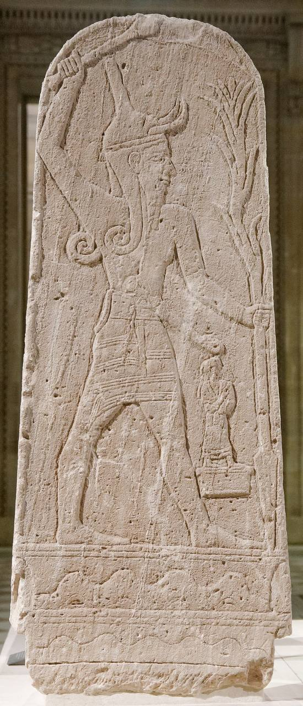

# 5. Formulaic language in ancient texts

*Hour 3 · ~5 min reading + leads into notebook `3a` (~15 min)*

> **Status:** outline stub.

## Formulas everywhere
- **Mythological poetry** — repeated poetic formulas, parallelism, fixed epithets.
- **Letters** — opening address and politeness formulas (e.g. *thm X / l Y rgm*,
  *yslm lk*, *ilm tgrk tslmk*).
- **Administrative documents** — accounting templates (name + quantity).
- **Ritual texts** — repeated instructions and offering formulas.

*Figure: **Stèle du Baal au foudre**, Middle/Late Bronze Age
(-2000 / -1150), discovered on the Ras Shamra acropolis, west of the Temple of
Baal. Louvre, Département des Antiquités orientales, AO 15775 / RS 4.427.
Source: [Louvre collections](https://collections.louvre.fr/en/ark:/53355/cl010140542).
Image © 2006 GrandPalaisRmn (musée du Louvre) / Franck Raux.*

## Baal formulas to watch for

Frequent formulas are easiest to see as repeated two- or three-word clusters.
For Baal, common CUC bigrams include:

| Formula | Working gloss | Why it matters |
|---------|---------------|----------------|
| *aliyn bʿl* | Mighty Baal / Aliyan Baal | Standard poetic epithet. |
| *zbl bʿl* | Prince Baal | Royal/divine title. |
| *bʿl ṣpn* | Baal of Ṣapān/Zaphon | Links Baal to his sacred mountain. |
| *bʿl ugrt* | Baal of Ugarit | Local cultic/geographic title. |

Other Baal-cycle formulas may not include the word *bʿl* itself. A classic
example is *rkb ʿrpt*, "Rider on the Clouds," a storm-god epithet useful for
comparison with Northwest Semitic and biblical poetic language.

## Link to biblical poetry
Ugaritic parallelism and stock phrasing illuminate the **formulaic** character of
biblical Hebrew poetry — a classic comparative-philology point.

Britannica highlights the same reason Ugarit matters for biblical studies: the
Keret, Aqhat, Baal, and Death of Baal texts preserve Old Canaanite mythological
traditions, with El, Asherah, and Baal as major divine figures. For this workshop,
the practical point is simple: repeated phrases and poetic structures are not
only literary texture; they are comparative data.

*Background source: Encyclopaedia Britannica,
["Ugarit"](https://www.britannica.com/place/Ugarit).*

## Query shortcuts

The CUC HuggingFace SQL console can generate quick formula statistics:

- Different forms of the verb *mḫṣ*: <https://huggingface.co/datasets/AlexWalhai/cuc/sql-console/s0OtjoK>
- Duplicate lines: <https://huggingface.co/datasets/AlexWalhai/cuc/sql-console/R1I-wQN>
- Hapax forms: <https://huggingface.co/datasets/AlexWalhai/cuc/sql-console/vCEN3c3>
- Frequent trigrams: <https://huggingface.co/datasets/AlexWalhai/cuc/sql-console/MWcTEYB>
- Frequent bigrams: <https://huggingface.co/datasets/AlexWalhai/cuc/sql-console/mRt27_k>
- N-grams with references: <https://huggingface.co/datasets/AlexWalhai/cuc/sql-console/c6PHRP_>

For Baal epithets, filter frequent bigrams where either word is `bʿl`; this
surfaces clusters such as *aliyn bʿl*, *zbl bʿl*, *bʿl ṣpn*, and *bʿl ugrt*.

> **Transition:** we find formulas automatically with **n-grams** (bigrams and
> trigrams) in notebook `3a_ngrams_formulas`, then compare across genres.
