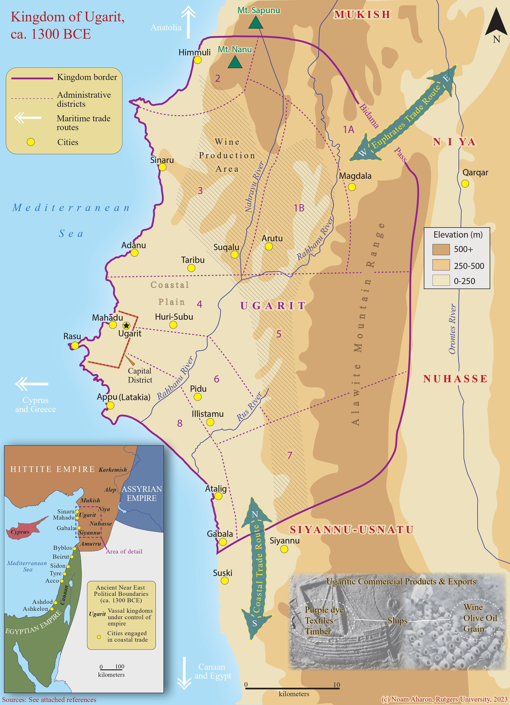
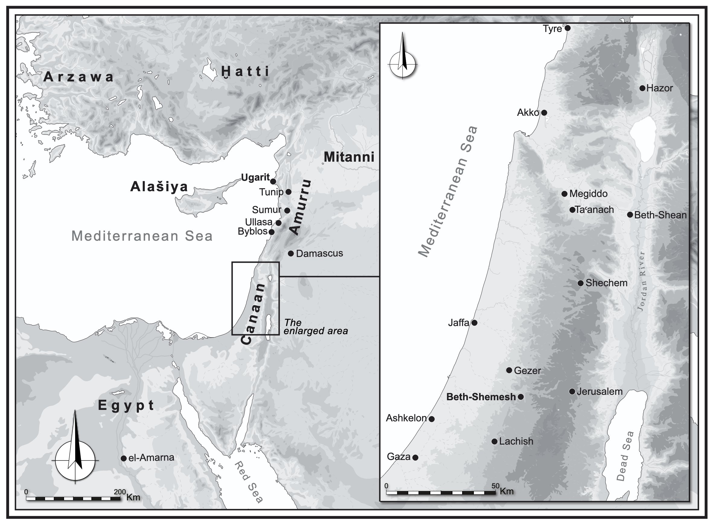
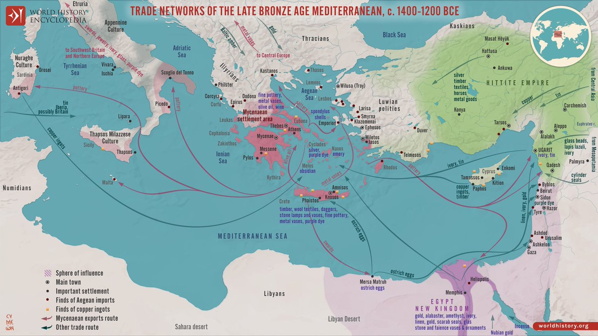
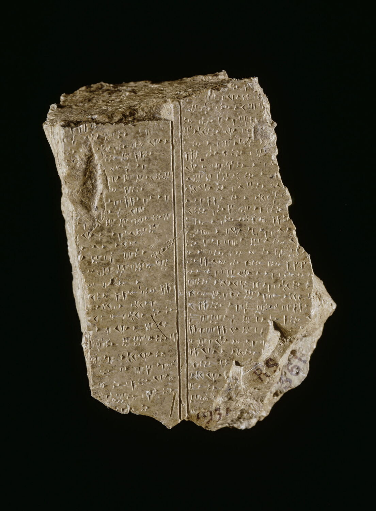

<!--
DRAFT deck — co-build. Render with Marp (see slides/README.md).
Speaker notes are in HTML comments like this one.
Hour 1 budget (60 min): history 20 · corpora 15 (→1a) · alphabet/language 10 · hypothesis 15 (→1b).
Figures live in ../images/. Notebook cues marked ▶.
-->

# Ugarit & Digital Humanities
## Hour 1 — Corpora and data

From a clay tablet to a dataset you can question.

<!-- 1 min. Set the tone: you don't need to code to follow; you need curiosity.
Today's promise: by the end you'll have run real analysis on a 3,000-year-old corpus yourself. -->

---

## Why Ugarit?

- A Late Bronze Age city-state — **compact** corpus, **rich** in genres.
- Small enough to analyse end-to-end in an afternoon; big enough to show real patterns.
- An early backdrop to the **biblical** world (El, Baal, Athirat).

<!-- 2 min. The pitch for Ugarit as the *perfect* DH teaching corpus. -->

---

## Where and when

- **Ras Shamra**, north Syrian coast.
- Flourished **c. 1450–1185 BCE**.
- A hub between **Egypt, Hatti, Mesopotamia, Cyprus, the Levant**.

<!-- 3 min. Orient them in space and time. Map: Ugarit in the LBA Levant. -->

---

## A crossroads of powers

- Trade and diplomacy in every direction.
- Multilingual scribes: **Ugaritic, Akkadian, Sumerian, Hurrian**.
- Several scripts in circulation at once.

<!-- 3 min. Ugarit as cosmopolitan. Tie to: why the archives are so varied. -->

---

## The site and its archives

- Palace and temple **archives** of clay tablets.
- Excavated **1928–1939**, then **1950–2008**.
- → KTU 1.1, the first tablet of the **Baal** myth (shown).

<!-- 3 min. Image: Louvre AO 16641, KTU 1.1. The texts survived because the city was never reoccupied. -->

---

## Then it ended

- Destroyed **c. 1185 BCE** in the Bronze Age collapse.
- **Never reoccupied** — which is *why* the archives stayed in place.
- A sealed time capsule of a literate society.

<!-- 2 min. The collapse as the reason we have the data. -->

---

## One tablet, many forms

A single tablet exists at once as:

> museum object · photograph · transliteration · translation · commentary ·
> dictionary references · catalogue entry · corpus record · bibliography

**The first DH task is integrating these scattered representations.**

<!-- 3 min. The core idea of docs/02. The problem isn't reading one tablet; it's connecting nine views of it. -->

---

## A corpus is a graph, not a book

- Not an e-book — a **graph of objects and features**.
- **tablet → column → line → word → sign**, each with features.
- The same model powers **BHSA** (Hebrew Bible) and **DSS**.

<!-- 2 min. Reframe "corpus" for non-coders. This is what they'll see in the notebook. -->

---

## The resources we'll use

- **CUC** — Copenhagen Ugaritic Corpus (278 tablets, Text-Fabric → JSONL).
- **ContextFabric** — graph engine + MCP server for AI agents.
- **UDB** — Ugaritic Data Bank (transliteration + commentary).
- **KTU** — the standard numbering; **DULAT** — the dictionary.

<!-- 2 min. Name the landscape; details in docs/00-resources.md. -->

---

## ▶ Hands-on 1a — open the corpus in code

**Notebook:** `1a_corpora_and_data` · *Open in Colab from the README.*

- Load 278 real tablets with one line.
- See each line in **Latin + cuneiform**.
- Ask the corpus questions: find a word, count tablets, browse genres.

<!-- 15 min including this slide. Walk them through running the setup cell. Reassure: just press play. -->

---

## The Ugaritic alphabet

- A **cuneiform alphabet** — wedges, but alphabetic (not syllabic).
- ~**30 signs**; order known from school **abecedaries**.
- One of the earliest attested alphabetic orders.

<!-- 4 min. Bridge from corpus to script. Figure: Ugaritic within Semitic. -->

---

## The "optimal design" claim

> "…the letters requiring the fewest strokes may have represented the most
> frequently heard sounds… Those two laborsaving devices could hardly have
> arisen by chance."
> — **Jared Diamond**, *Writing Right* (1994)

Three testable claims: **economy**, **simple = frequent**, **order ≈ frequency**.

<!-- 4 min. Set up the myth-busting. Let the claim sound persuasive before we test it. -->

---

## ▶ Hands-on 1b — test it with data

**Notebook:** `1b_alphabet_hypothesis`

- Real **sign frequencies** (from the cuneiform) × a **complexity** score (wedges + turns).
- Claim A: do *earlier* signs occur more? Claim B: are *frequent* signs *simpler*?
- You compute the correlations and decide.

<!-- 11 min including this slide. Don't pre-spoil the result — let them find that the correlations are ~0. -->

---

## What did the data say?

- Both correlations come out **near zero** in the corpus.
- A beautiful claim — but the evidence is weak.
- **The method matters more than the verdict:** you just tested a famous idea in minutes.

<!-- 2 min. The takeaway: corpus methods let humanists check claims themselves. Caveats: damaged text, one complexity metric. -->

---

## Recap — Hour 1

- Ugarit: a compact, rich, sealed corpus.
- A corpus is a **graph of objects**, integrated from many sources.
- You loaded it, queried it, and tested a real hypothesis.

**Next:** can the machine *see* the genres? → Hour 2.

<!-- 1 min. Bridge to Hour 2 headline. -->
