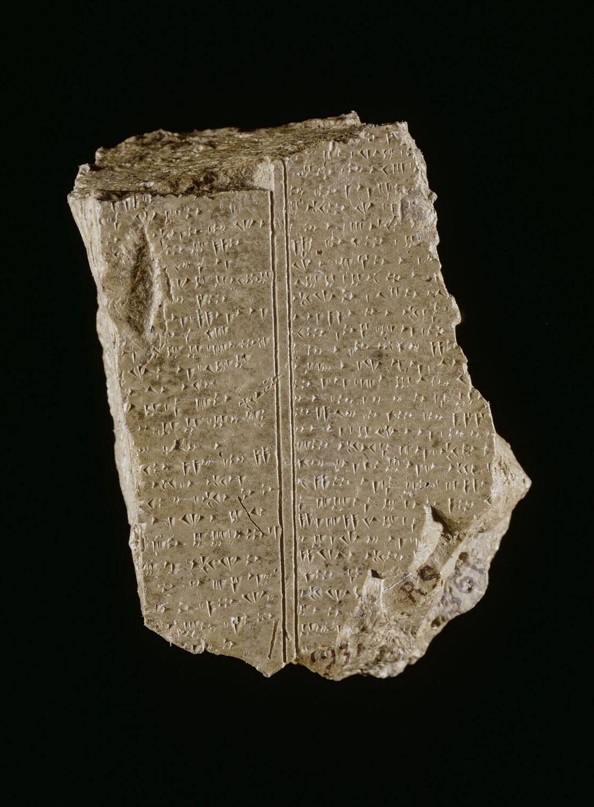

<!--
DRAFT deck — co-build. Hour 2 budget (60 min):
labels + sampling 10 · TF-IDF 15 · genre map 20 · validation 10 · close reading 5.
The single Hour-2 notebook carries the full argument. Figures in ../images/.
-->

# Ugarit & Digital Humanities
## Hour 2 — From words to genres

How much genre signal is present in vocabulary alone?

<!-- 1 min. Today's headline question. Keep it suspenseful. -->

---

## The genres of Ugaritic texts

- **Myth / epic** — Baal, Kirta, Aqhat (KTU 1.x)
- **Ritual** — sacrifices, calendars, liturgies
- **Divination** — omens, conditional "if → then"
- **Letters** (KTU 2.x) · **Legal / economic** (KTU 3–4) · **Lexical** (KTU 5)

<!-- 3 min. The map of genres. KTU's first digit already encodes a coarse genre. -->

---

## First: where do the labels come from?

- KTU's first digit is an **editorial classification**: 1 literary/religious,
  2 letters, 3 legal, 4 economic, 5 scribal.
- The notebook adds finer teaching labels for selected tablets.
- These are useful comparison labels—not neutral, timeless ground truth.

**Central question:** can vocabulary reproduce any of that editorial structure?

<!-- 2 min. Sets up the whole hour: vocabulary vs the official label. -->

---

## Distinctive words: the TF-IDF idea

- Common words (*and*, *to*, *the*) are everywhere — they don't *characterise* a text.
- **TF-IDF** rewards words frequent **in one tablet** but rare **across the corpus**.
- Result: each tablet's *signature* vocabulary.

<!-- 3 min. Intuition only, no math. "Which words are surprisingly common here?" -->

---

## ▶ Hands-on 2 — keywords first

**Notebook:** `2_similarity_clustering`

- Compute TF-IDF keywords per tablet.
- **Game:** read the keywords, guess the label, then check the text.
- Caveat: CUC has **no lemmas** — word *forms* only; homographs blur the signal.

<!-- 17 min including this slide. Make the guessing interactive with the room. -->

---

## From keywords to a map

- Turn each tablet into a **vector** of its vocabulary.
- Similar vocabulary → near in "vocabulary space".
- Squash to 2-D so we can **see** it.

<!-- 2 min. Bridge to the headline. Each dot will be a tablet. -->

---

## ▶ The genre map ⭐

**Notebook:** `2_similarity_clustering` — **today's headline**

- Interactive **UMAP** scatter — **hover any point to read that tablet**.
- Coloured afterward by our editorial/teaching label.
- **The question:** do similarly labelled tablets occupy similar regions?

<!-- 20 min including this slide. This is THE moment. Run it live, hover a few tablets, let them gasp.
BACKUP: screenshot the rendered map in advance (save to ../images/genre_map.png) in case the live run fails. -->

---

## A picture is not a validation

- UMAP makes neighbourhoods visible, but its coloured map is **exploratory**.
- Blind KMeans only partly matches the labels: **ARI ≈ 0.34**.
- Its clusters are diffuse: **silhouette ≈ 0.03**.
- A 3-fold vocabulary classifier reaches **≈ 83%**, versus **≈ 33%** baseline.

<!-- 4 min. Distinguish projection, clustering, and supervised prediction. Values are from the bundled CUC sample, ≥30 tokens, fixed seeds. -->

---

## Where machine and scholars disagree

- Ritual ↔ divination may blur (shared cultic vocabulary).
- Short / damaged tablets drift.
- Some "errors" expose the limits of our own labels (e.g. KTU 1.96).
- **A disagreement becomes evidence only after close reading.**

<!-- 2 min. Intellectual honesty + a hook for further research. -->

---

## Recap — Hour 2

- Vocabulary carries substantial **predictive signal**, but not clean natural clusters.
- TF-IDF → projection → clustering/classification → **validation**.
- The model proposes patterns; philology tests them against tablets and editions.

**Next:** from words to **structures** — formulas, networks, decision trees. → Hour 3.

<!-- 1 min. Bridge to Hour 3. -->
