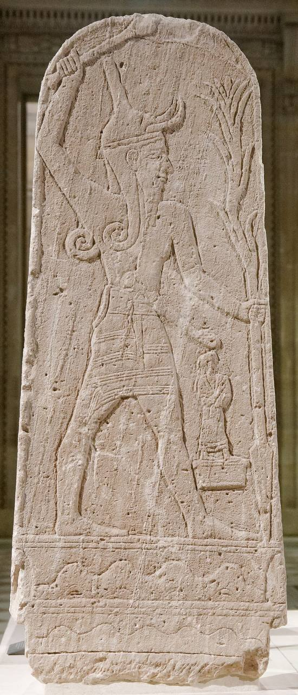

<!--
DRAFT deck — co-build. Hour 3 budget (60 min):
formulas 10 (→3a) · networks 10 (→3b) · divination 10 (→3c) ·
modern toolkit + AI-build demo 20 · get-involved 10.
The AI-build demo follows docs/hour3-agent-runbook.md. Notebook cues marked ▶.
-->

# Ugarit & Digital Humanities
## Hour 3 — From texts to structures

From repeated language to modeled structures—and back to sources.

<!-- 1 min. We move from counting words to recovering structure. -->

---

## Ancient texts are full of formulas

- Myth: recurring epithets — *aliyn bʿl* "Mighty Baal", *rkb ʿrpt* "Rider on the Clouds".
- Letters: *tḥm X · l Y rgm* (address), *yšlm lk* (greeting).
- Ritual & admin: repeated instructions and templates.

<!-- 3 min. Figure: Baal stele (Louvre AO 15775). Formulas = repeated n-grams. -->

---

## ▶ Hands-on 3a — find formulas with n-grams

**Notebook:** `3a_ngrams_formulas`

- Count repeated 2- and 3-word sequences across the corpus.
- Real results pop out: **kṯr w ḫss** (the god Kothar-wa-Hasis),
  **rbt aṯrt ym** ("Lady Athirat of the Sea"), **yšu gh w yṣḥ** ("he lifted his voice and cried").

**Check:** recurrence across texts + KWIC context + editorial reading.

<!-- 9 min including slide. The machine surfaces genuine epithets/formulas from raw text. -->

---

## Letters as social data

- An address formula can encode a relationship: **sender → recipient**.
- Beyond reading one letter, study the **network** of correspondents.

<!-- 3 min. The address formula is structured data hiding in plain sight. -->

---

## ▶ Hands-on 3b — the correspondence network

**Notebook:** `3b_letter_networks`

- Parse *tḥm X / l Y* into candidate **sender → recipient** edges.
- Build and draw the graph; find central figures (*mlk* the king, *umy* "my lady").
- Caveat: titles ≠ unique persons; preservation and formula recognition bias the graph.

**Check:** inspect every extracted edge before interpreting centrality.

<!-- 9 min including slide. -->

---

## Omen texts as conditional structures

- Omen manuals often pair a **protasis** (observed condition) with an
  **apodosis** (predicted consequence).
- A tree is our analytical model of that structure—not an ancient flowchart.

<!-- 3 min. RS 24.247+ / KTU 1.103+1.145 is the case. -->

---

## ▶ Hands-on 3c — the omen decision tree

**Notebook:** `3c_divination_trees`

- RS 24.247+ / KTU 1.103+1.145 → nested JSON → a visual tree.
- Compare Ugaritic and Mesopotamian organization without treating them as identical.
- Sets up the AI question: *can a model extract structure without erasing uncertainty?*

<!-- 9 min including slide. Bridge straight into the LLM block. -->

---

## LLMs: helpful and dangerous

- **Help:** extract structure, validate JSON, compare trees, explain in plain language.
- **Danger:** invent missing branches (`[…]` gaps), smooth over ambiguity, drop philology.
- Keep **raw text, normalization, model output, and human corrections** separate.
- The philologist remains responsible for readings, uncertainty, and interpretation.

<!-- 3 min. The honest core of the AI message. -->

---

## The modern toolkit — the whole picture

> corpus **+** dictionary **+** images **+** bibliography **+** morphology
> **+** Python **+** ContextFabric **+** LLM / agents **+** **human validation**

Each layer has provenance, assumptions, and a point where it can fail.

<!-- 2 min. docs/08. Pull the three hours together into one architecture. -->

---

## DEMO — watch AI build a research tool

**A PDF is not data. Watch us make it data.** *(see hour3-agent-runbook.md)*

- A coding agent turns a participant-supplied **UDB** PDF → a local,
  queryable **SQLite**.
- Then we run checked SQL and translate results into plain language.
- Free tool, local workflow: *you could repeat the method on a source you are
  authorized to process.*

<!-- 10 min. Screen-share the agent (Antigravity free tier). Recording ready as fallback. -->

---

## The catch

- Keep one **gold-standard record** and a small regression test.
- Compare every extracted field with the PDF page and preserve brackets/gaps.
- Treat fluent answers as interfaces to evidence, never as evidence themselves.

<!-- 2 min. The caution beat — do not cut this. -->

---

## Get involved & keep learning

- **Contribute:** report errors, help annotate CUC, build a small tool.
- **Stay in touch:** group chat + my inbox *(details on the handout)*.
- **Learn Ugaritic:** UCU · Helsinki · Polis · Huehnergard's grammar.

→ `docs/09-get-involved.md`

<!-- 8 min incl. Q&A. The networking goal. Make the ask concrete: pick one step this week. -->

---

# Thank you

You ran real analyses, built a tool with AI, and learned where it needs *you*.

**The field is more open than it looked this morning.**

— 〔your name / contact〕

<!-- Close warm. Leave contact + chat link on screen during Q&A. -->
